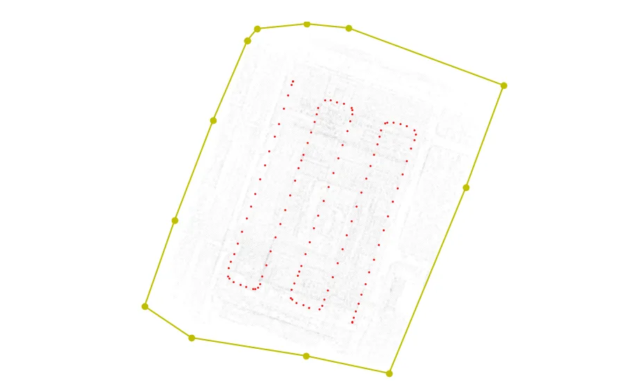
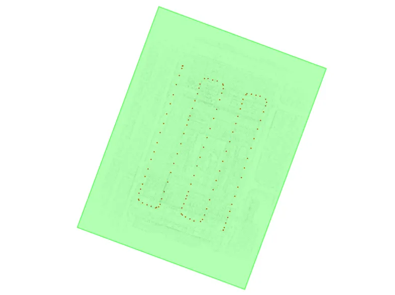
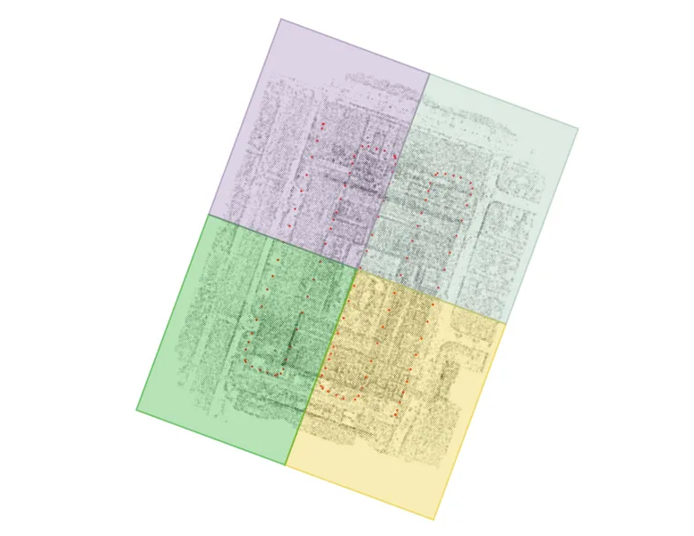
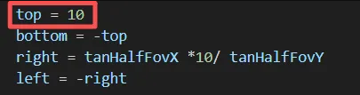

# Introduction

We propose a rapid generation framework for large-scale DOM based on load-balanced 3D Gaussian Splatting. The following is the deployment workflow.

## 1.Environment Installation

If you already have the 3DGS (3D Gaussian Splatting) environment set up, the installation is very straightforward. First, activate the 3DGS environment,then

```
pip install opencv-python
pip install easydict  
```

If you do not have the 3DGS environment set up, you will need to install it from scratch.

```
conda env create --file environment.yml
conda activate gaussian-ortho
```

## 2.Dataset Preparation

Click here to download our  HHU dataset：

https://pan.baidu.com/s/1sd6c6KRX99OoPE_SWZoU2Q?pwd=wjag

The NPU DroneMap dataset is created in:
S. Bu, Y. Zhao, G. Wan, and Z. Liu, "Map2DFusion: Real-time incremental UAV image mosaicing based on monocular SLAM," in 2016 IEEE/RSJ International Conference on Intelligent Robots and Systems (IROS), Daejeon, Korea, 2016, pp. 4564-4571, doi: 10.1109/IROS.2016.7759672.
Download here please: 

https://pan.baidu.com/s/1bW-4qtNzJzdQAo8QdOG-KA?pwd=vaxv#list/path=%2F&parentPath=%2Fsharelink167776736-330197192604313


We use Glomap to prepare the data; for details, refer to：

https://github.com/colmap/glomap

Using Glomap can significantly improve the initialization efficiency.  

We expect the following dataset structure in the source path location.

```
<location>
|---images
|   |---<image 0>
|   |---<image 1>
|   |---...
|---sparse
    |---0
        |---cameras.bin
        |---images.bin
        |---points3D.bin
```

## 3.Estimate depth maps of training views(Optional)

1. Download DepthAnythingV2 checkpoints and put it under `preprocess/Depth-Anything-V2/checkpoints`

2. Estimate depth maps and depth-aligning parameters

   ```
   python preprocess/estimate_depth_and_rescale.py -s datasets/scene_dirpath
   ```

## 4.Configure the yaml file

Create scene_name.yaml under folder configs and configure the setting. The meaning of the parameters are noted as follows:

```
### scene params ###
scene_dirpath: ./datasets/hhu-building1     # scene data dirpath
output_dirpath: ./output/hhu-building1      # output folder
white_background: false                     # background color of the scene
sh_degree: 3                                # max spherical harmonics degree
evaluate: false                             # split evaluate views
scene_scale: 1.0                            # rescale ratio of entire scene
image_scale: 0.25                           # rescale ratio of training image

### scene partition params ###
expand_ratio: 0.05                        # scene partition param, block boundary expanding ratio
vertical_axis: "z"                        # scene partition param, vertical axis
max_tree_depth: 2                         # scene partition param, max bitree depth when partition the scene
num_points_thresh: 300000                 # scene partition param, block split condition
cover_ratio_thresh: 0.3                   # scene partition param, view assignment thresh, 0-1

### training params ###
num_workers: 8                            # number workers when loading data
batch_size: 1                             # batch size during training
preload: "cpu" # "cpu" / "none"           # preload or not
iterations: 40000                         # iteration of each block
position_lr_init: 0.00016                 # initial 3D position learning rate
position_lr_final: 0.0000016              # final 3D position learning rate
position_lr_delay_mult: 0.01              # position learning rate multiplier
position_lr_max_steps: None               # number of learning rate steps, if None, equal to iterations
feature_lr: 0.0025                        # spherical harmonics features learning rate
opacity_lr: 0.025                         # opacity learning rate
scaling_lr: 0.005                         # scaling learning rate
rotation_lr: 0.001                        # rotation learning rate
random_background: false                  # flag to use random background during training
lambda_dssim: 0.2                         # influence of SSIM on photometric loss
depth_l1_weight_init: 1.0                 # initial weight of depth_inv loss 
depth_l1_weight_final: 0.1                # final weight of depth_inv loss
reproj_l1_weight_init: 0.01               # initial weight of pseudo-view loss
reproj_l1_weight_final: 0.5               # final weight of pseudo-view loss
depth_inv_loss: false                     # flag to use depth_inv loss
pesudo_loss: false                        # flag to use pseudo-view loss
pesudo_loss_start: 5000                   # start iteration of pseudo-view loss

### densify and prune params ###
percent_dense: 0.01          # percentage of scene extent (0-1) a point must exceed to be forcibly densified
densify_grad_threshold: 0.0002       # limit that decides if points should be densified
densification_interval: 200          # how frequently to densify
densify_from_iter: 1000              # iteration where densification starts
densify_until_iter: None         # iteration where densification stops, if None, equal to iterations//2
opacity_reset_interval: None     # how frequently to reset opacity, if None, equal to iterations//10
min_opacity: 0.005                   # opacity thresh when pruning
densify_only_in_block: true          # flag to densify only in block

### rendering paramss ###
convert_SHs_python: false
compute_cov3D_python: false
debug: false
antialiasing: false
```

## 5.Scene partition and view assignment

First, manually select the regions of interest (ROI) and assign relevant views to each region. 

```
python scene_partition.py -c ./configs/scene_name.yaml
```

Manually select the area in the pop-up window, and press Enter to close the path.



The Region of Interest (ROI) and scene segmentation information will be exported to the output folder.







## 6.Training

Supports both sequential training on a single GPU and parallel training across multiple GPUs.

```
python parallel_train.py -c ./configs/scene_name.yaml --num_blocks 4 --num_gpus 2
--config / -c : config file path
--num_blocks : the number of blocks of the scene
--num_gpus : the number of gpus of platform
```

## 7.Merge block results

Postfix individual block reconstruction results and merge to fetch the entire scene gaussian plyfile.

```
python block_fusion.py -o ./output/scene_name --merge
--optimized_path / -o : the directoy path the results are stored
--merge : flag to merge all block result to get point_cloud_merged.ply
```

## 8.Orthographic Rendering  

Following the perspective training, we will now proceed to orthographic rendering.

Some parameter modifications are required before proceeding. 

1.First, in `scene/cameras.py`, change the method `def get_full_proj_transform(self, orthographic=False)` to `def get_full_proj_transform(self, orthographic=True)`. 

2.Then, in `gaussian_renderer/__init__.py`, update the `def render(viewpoint_camera, pc : GaussianModel, pipe, bg_color : torch.Tensor, scaling_modifier = 1.0, separate_sh = False, override_color = None, use_trained_exp=False,orthographic=False)` method to `def render(viewpoint_camera, pc : GaussianModel, pipe, bg_color : torch.Tensor, scaling_modifier = 1.0, separate_sh = False, override_color = None, use_trained_exp=False,orthographic=True).` 

3.Finally, in `submodules/diff-gaussian_rasterization/cuda_rasterizer/forward.cu`, modify the device function `__device__ float3 computeCov2D(const float3& mean, float focal_x, float focal_y, float tan_fovx, float tan_fovy, const float* cov3D, const float* viewmatrix,bool orthographic=false)` to `__device__ float3 computeCov2D(const float3& mean, float focal_x, float focal_y, float tan_fovx, float tan_fovy, const float* cov3D, const float* viewmatrix,bool orthographic=true)`

4.Since the `forward.cu` file was modified, you must reinstall the package to recompile the source code.  

```
pip uninstall diff-gaussian-rasterization
pip cache purge
pip install submodules/diff-gaussian-rasterization 
```

5.Set the image resolution via the `image_scale` parameter in the `scene_name.yaml` configuration file. The displayed scene size can be adjusted by setting the `top` value in the `getProjectionMatrixCUDA` method within `utils/graphics_utils.py`，The larger the top value, the larger the visible area of the scene.



6.Perform orthographic rendering.  

```
python render_views.py -o ./output/scene_name
```

Once rendering is complete, the generated orthographic images will be available in `output/scene_name/render`. Simply select the one that provides full coverage and the best visual quality.
 If you want to continue training on other datasets, simply change the parameter `orthographic=True` to `False` and recompile; then, you can proceed with training using perspective projection.  

## Citation


## Acknowledgements

Our code is inspired by  .